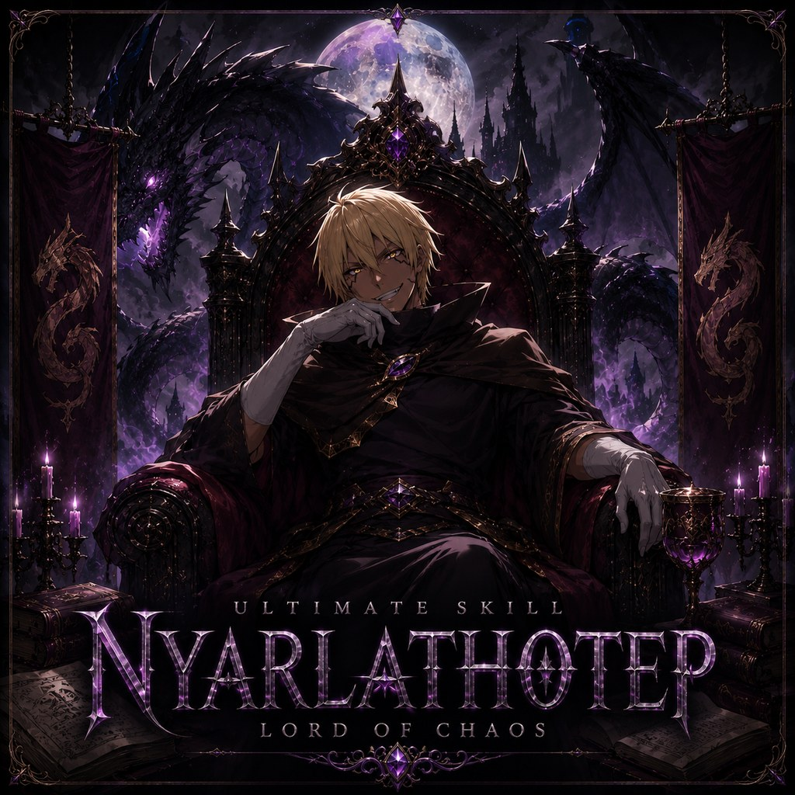

# Nyarlathotep, Lord of Chaos

<p align="center"></p>

A server-side BepInEx IL2CPP plugin for V Rising that adds admin-configured, event-driven NPC behaviour.
0.2.x ships the event engine with spawn-wave events, wave warnings and banners, and a kill switch; timed
faction empowerment, castle sieges, defended zones, boss-fight reinforcements, spawn modifiers and
leaderboards are planned, one release each. The companion client Raphael reads a machine-readable API.

0.2.x is a public beta. Every pillar and automatic announcement starts disabled; admins opt in. The 0.1.0 key
`General.AnnounceEvents` is retired and ignored; the `[Announcements]` switches replace it.

## Status

**v0.2.1.** See [`CHANGELOG.md`](CHANGELOG.md) for what ships and [`docs/dod/`](docs/dod/) for the
build plan.

## How it works

Every feature is an **event**: a *trigger* (schedule, V Blood kill, boss health phase, zone activity,
admin command) fires an *action* (empower a faction, spawn waves with a behaviour) for a *duration*, after
which everything the event created is reverted or despawned. Four services carry the load: `TriggerBus`,
`EventScheduler`, `SpawnTracker`, and the per-pillar action services.

## Features

| Feature | State | Design doc |
|---|---|---|
| Event engine, spawn-wave events, kill switch | 0.2.0 | [`docs/features/FOUNDATION.md`](docs/features/FOUNDATION.md) |
| Announcements (warnings, banners, daily banner) | 0.2.0 | [`docs/features/FOUNDATION.md`](docs/features/FOUNDATION.md) |
| Raphael handshake (`.nyar api version`) | 0.2.0 | [`docs/RAPHAEL_INTEGRATION_CONTRACT.md`](docs/RAPHAEL_INTEGRATION_CONTRACT.md) |
| Event spawn modifiers and locations | in development | [`docs/features/EVENT_SPAWNS.md`](docs/features/EVENT_SPAWNS.md) |
| Faction empowerment | in development | [`docs/features/FACTION_EMPOWERMENT.md`](docs/features/FACTION_EMPOWERMENT.md) |
| Boss reinforcements | in development | [`docs/features/BOSS_REINFORCEMENTS.md`](docs/features/BOSS_REINFORCEMENTS.md) |
| Defended zones | in development | [`docs/features/DEFENDED_ZONES.md`](docs/features/DEFENDED_ZONES.md) |
| Sieges | in development | [`docs/features/SIEGES.md`](docs/features/SIEGES.md) |
| Stats and leaderboards | in development | Epic plan Business rules 11–12 ([`docs/dod/nyarlathotep.md`](docs/dod/nyarlathotep.md)) |

## Architecture

`Logic/` holds the rules with no game dependency (validation, precedence, schedules, the spawn ledger, the
announcer, wire format) and is unit-tested. `Services/` drive it from the game: `EventStore` and `Persistence`
(JSON files under `BepInEx/config/Nyarlathotep/`), `TriggerBus` (hooks), `EventScheduler` (one main-thread
tick in phases), `EventRuntime`, `SpawnTracker` (budgeted spawns and despawns, the boot sweep) and `Announcer`.
Every mutating operation goes through `Logic/ActionGateway`; `tools/preflight.ps1` checks that statically.

## Layout

```
Nyarlathotep/Nyarlathotep/        C# project (Plugin, Core, Patches, Services, Commands, Config, Logic, Resources)
Nyarlathotep/Nyarlathotep.Tests/  xUnit tests over Logic/ (no game needed)
docs/                             design, DoD plans, audits, feature docs, research, asset guide
tools/preflight.ps1               release-surface sync and safety checks (-SelfTest, -LogCheck, -Paths, ...)
tools/ingame/                     helpers for in-game test sessions on a development world
```

## Building

```powershell
cd Nyarlathotep
dotnet build Nyarlathotep.sln -c Release                                        # build + deploy to local server
dotnet build Nyarlathotep.sln -c Release -p:VRisingServerPath=C:\__nodeploy__  # compile check only
dotnet test Nyarlathotep.sln                                                    # unit tests
```

Targets `net6.0` with `BepInEx.Unity.IL2CPP` 6.0.0-be.733, `VampireReferenceAssemblies` 1.1.12, and
VampireCommandFramework 0.10.

## Release discipline

Six surfaces move together in one `chore(release): vX.Y.Z` commit (csproj + toml versions, both
changelogs, both READMEs). Run `pwsh tools/preflight.ps1` first.

## Docs

- [`docs/NYARLATHOTEP_DESIGN.md`](docs/NYARLATHOTEP_DESIGN.md) — architecture, config, the command reference (§6), build order, decisions
- [`docs/RAPHAEL_INTEGRATION_CONTRACT.md`](docs/RAPHAEL_INTEGRATION_CONTRACT.md) — the `[NYAR:*]` wire contract for Raphael
- [`docs/dod/`](docs/dod/) — Definition-of-Done plans, reviews and progress
- [`docs/RESEARCH_NOTES.md`](docs/RESEARCH_NOTES.md) — what we learned from sibling mods, reference mods, and Thunderstore
- [`docs/GAME_ASSETS.md`](docs/GAME_ASSETS.md) — using the prefab dump; factions, buffs, units
- [`docs/DEV_REMINDERS.md`](docs/DEV_REMINDERS.md) — IL2CPP/ECS gotchas with sources

## License

AGPL-3.0-or-later.
